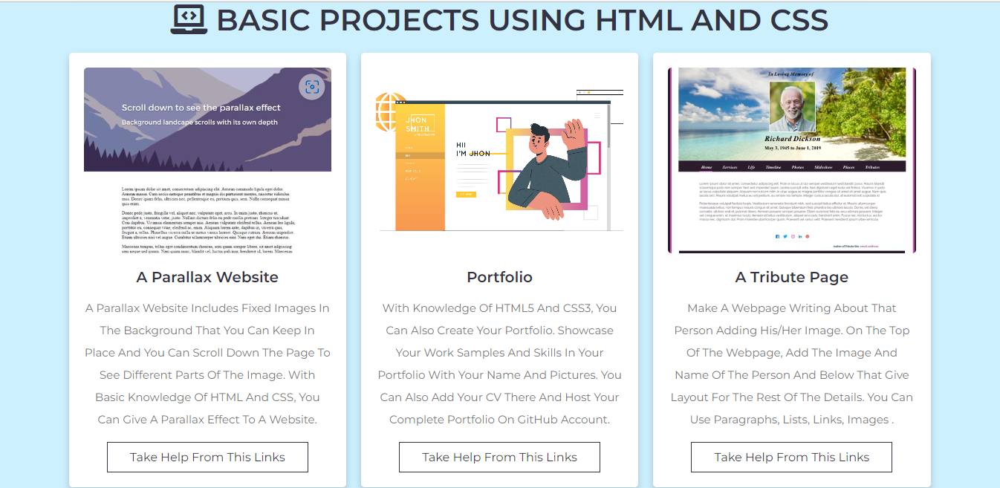

# Basic projects for html and css learners

Learning to code is exciting and fun for everyone. When stepping into the world of coding, most people start with the simplest things: HTML and CSS. A beginner's front-end coding journey begins with these two basic building blocks. Designing beautiful applications requires creativity. 

Initially, beginners enjoy creating buttons, adding links, adding images, manipulating layouts, and many other cool features of web design, but using only HTML and CSS they  get stuck and confused when it comes to creating projects. About what to do to put all this into practice. After all, their knowledge is limited to HTML and CSS. Either way, after learning all that, you'll find it important to create projects to practice your HTML and CSS skills. To design beautiful front-end applications, you need to see how HTML and CSS work together. So the question is what are some beginner-friendly projects you can build to practice everything you have learned… so in this file there are some basic projects for html and css learners.

 # Snapshot 
 

   </img>

# 📝Steps to run
 
- Clone the repo into local machine
- Open the folder with a code editor like VScode
- Run the index.html